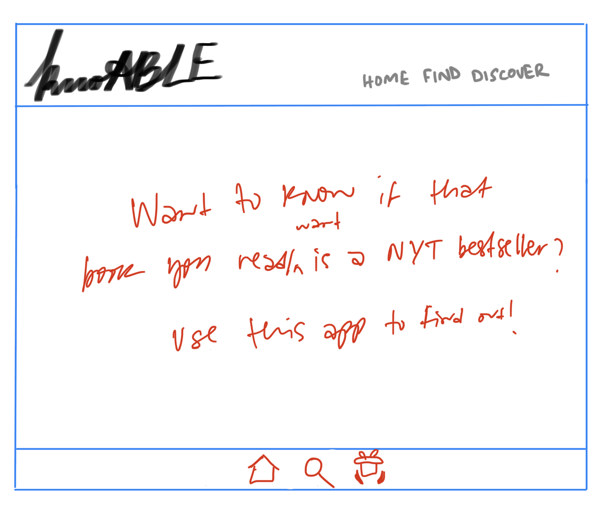
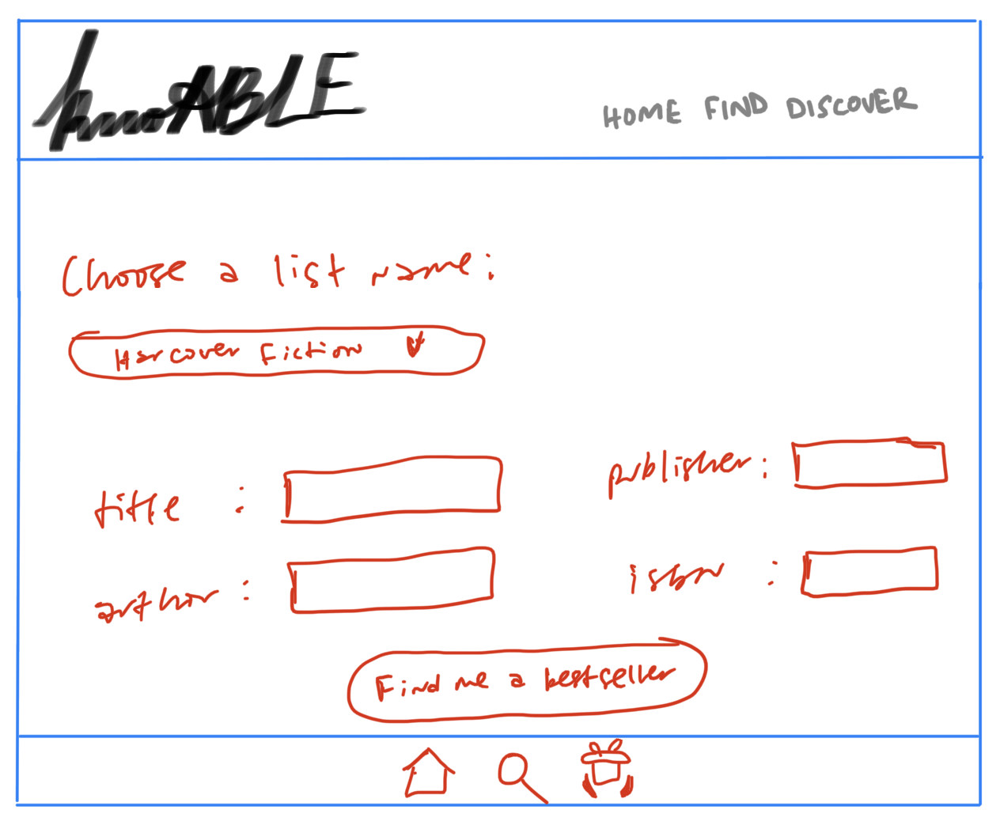
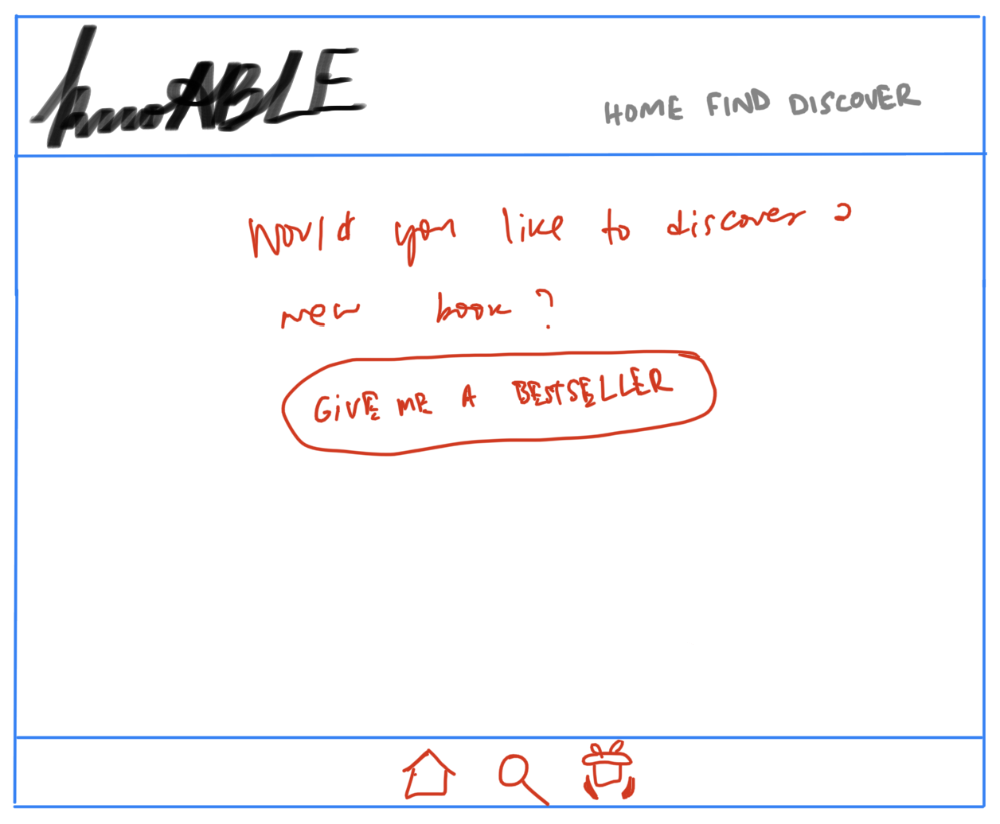
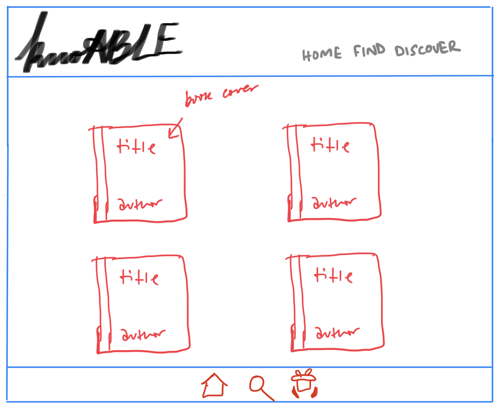
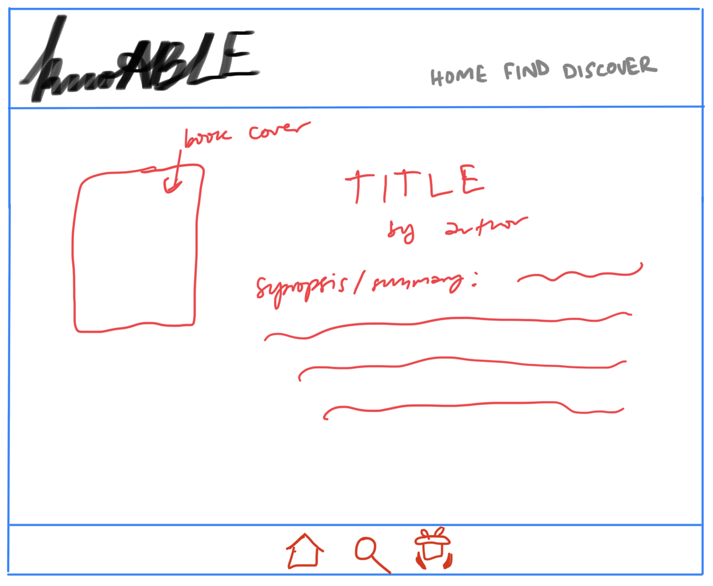
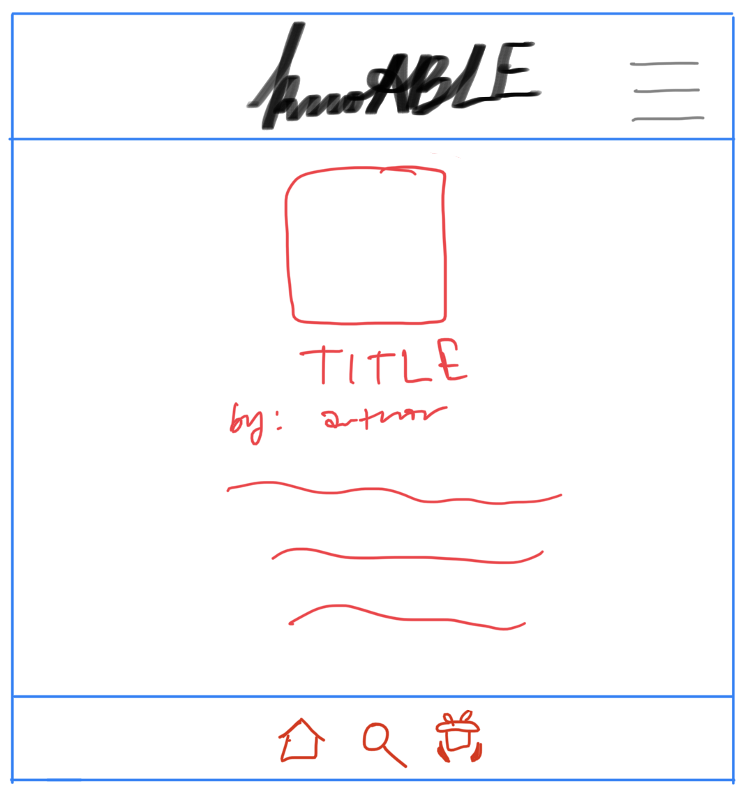
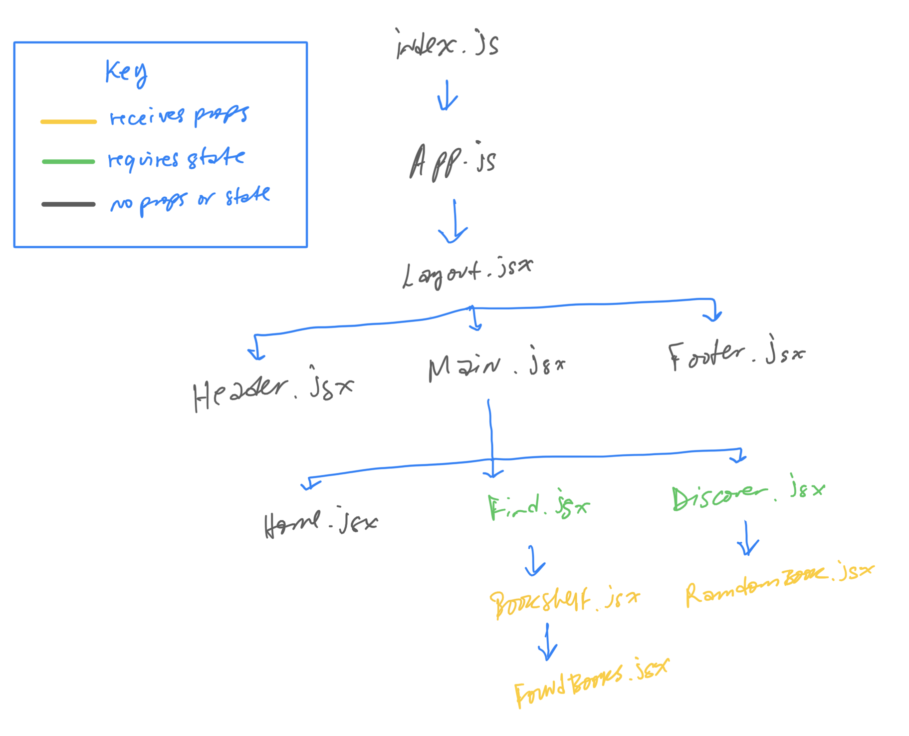

# knoABLE

Do you love reading books, but have a hard time finding new ones to read? Are you intrigued by books that have ranked in a New York Times bestseller's list? Well knoABLE is the app for you! ✨knoABLE✨ gets its name from the words ___knowledge___ and ___expandable___ being combined. It let's a user find out whether a book they read has been a NYT bestseller; or to get a book that has been, or is currently, a NYT bestseller. Checkout the [live site](https://knoable.netlify.app/).

## Built With:

- [React.js](reactjs.org)
- [Axios](axios-http.com)
- [React Router](reactrouter.com)
- [Postman](postman.com)
- [Google Fonts](fonts.google.com)
- [Font Awesome](fontawesome.com)

## Wireframes

### Desktop Views

#### Home

#### Find

#### Discover

#### Bookshelf

#### Book

### Mobile Views

#### Book

## Component Hierarchy

## API

I used the [New York Times Books API](https://developer.nytimes.com/docs/books-product/1/overview), and the [Google Books API](https://developers.google.com/books/docs/overview#books_api_v1).

## MVP

- [x] Use Axios for API calls
- [x] Incorporate React Router
- [x] Use two API endpoints
- [x] Have one page for searching based on criteria
- [x] Have another page to get a random book
- [x] Make it responsive

## Post-MVP

- [ ] 404 page
- [ ] Display more information for each book
- [ ] Add more search criterias
- [ ] Dark mode
